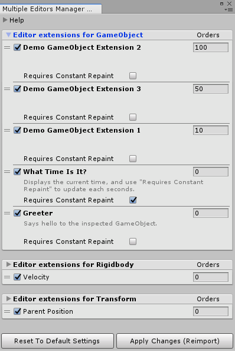

# Muffin Dev for Unity - Multiple Editors Manager - `MultipleEditorsManagerWindow`

Utility window that allows you to manage custom editor extensions from the editor.

## Manage extensions

Editor extensions are added through code, by creating a class that inherits from [`CustomEditorExtension`](./custom-editor-extension.md). When these extensions registers with the [main manager](./multiple-editors-manager.md), they can be used in the [multiple editor handlers](./multiple-editor-handler.md) that are the actual `Editor` class drawn in the inspector.

When it registers with the [manager](./multiple-editors-manager.md), an extension can define its default options (order, display name, etc.). These settings can be changed using this window.

**Note that changing any setting requires the code to be recompiled to take effect**. This can be done by clicking on *Apply Changes (Reimport)* button.

## Options

In the editor window, you can define several options for each extension. For convenience, all the options are not displayed by default. You can click on the foldout icon on the left of each list header to display these additional options.

- **Enable**: The toggle on the left of the name of each extension will enable/disable the extension
- **Order**: Defines the position of the extension in the inspector. The higher the value, the higher the extension is drawn in the inspector
- **Requires Constant Repaint**: If true, the extended `Editor` will set `Editor.RequireConstantRepaint()` to `true`, causing the inspector to repaint event when no input event occurs

## Controls

- ***Apply Changes (Reimport)***: Recompile the code in order to apply changes
- ***Reset To Default Settings***: Resets all the settings to their default value. NOte that this action will recompile the code to apply changes