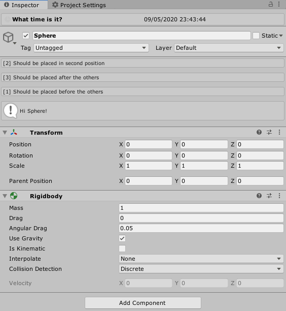

# Muffin Dev for Unity - Multiple Editors Manager

Allows you to create multiple editor extensions for the same target type through code. In the editor, you can use the manager's window to set these custom editor options : enable/disable them, change their order, etc.




## Architecture

The Multiple Editors system involve three classes: [`CustomEditorExtension`](./Documentation~/custom-editor-extension.md), [`MultipleEditorsHandler`](./Documentation~/multiple-editors-handler.md) and [`MultipleEditorsManager`](./Documentation~/multiple-editors-manager.md):

- [`CustomEditorExtension`](./Documentation~/custom-editor-extension.md) represents an editor extension. Each additional editor inherits from that class
- [`MultipleEditorsHandler`](./Documentation~/multiple-editors-handler.md) allows you to create a regular `Editor` that will use the extensions (it's the editor actually drawn in the inspector)
- [`MultipleEditorsManager`](./Documentation~/multiple-editors-manager.md) binds extensions and multiple editors handlers. All extensions have to register with the [`MultipleEditorsManager`](./Documentation~/multiple-editors-manager.md), and so the handler can get the additional extensions that target the same type from the main manager

## Demo

You can enable the Multiple Editors system demo by uncommenting the second line of the script at [`./Editor/Demos/DemoCustomObjectEditor.cs`](./Editor/Demos/DemoCustomObjectEditor.cs).

This will add custom editor extensions to `GameObject` native inspector, `Transform` and `Rigidbody` components.

You can also change their order and settings from the Multiple Editors Manager window in `Muffin Dev > Multiple Editors Manager`.

## Usage

In the following example, you'll see how to create a custom editor extension for `GameObject`:

```cs
using UnityEngine;
using UnityEditor;
using MuffinDev.EditorUtils.MultipleEditors;

// Use InitializeOnLoad attribute to ask for Unity to load this class after recompiling
[InitializeOnLoad]
public class GameObjectTestExtension : CustomEditorExtension<GameObject>
{
    // You must use the static constructor to register this custom editor extension
    static GameObjectTestExtension()
    {
        RegisterCustomEditor(() => { return new GameObjectTestExtension(); });
    }

    public override void OnHeaderGUI()
    {
        EditorGUILayout.HelpBox("Hello World!", MessageType.Info);
        EditorGUILayout.Space();
    }
}
```


There's some ready-to-use multiple editors managers in this module files, such as `GameObjectMultipleEditors`. This class uses `[CustomEditor(typeof(GameObject))]`, meaning it customize the `GameObject` editor. Since that class is already defined, you just have to create your own extension using the code above, and register it with the `MultipleEditorsManager` using the `RegisterCustomEditor()` method.

Of course, this works also with your own Objects. Note that the `CustomEditorExtension` class is generic, and the type to specify defines the target type of your custom editor extension. Here we want to target `GameObject`, but you can use `CustomEditorExtension<MyBehaviour>` to target a custom type.

**Note that register a custom editor extension must be done in the static constructor of your extensions.**

### Create your own multiple editors handler

First of all, create a custom `MonoBehaviour`:

```cs
using UnityEngine;

public class MyBehaviour : MonoBehaviour { }
```

Then, create the multiple editors handler for that specific type.

```cs
using UnityEngine;
using UnityEditor;
using MuffinDev.EditorUtils.MultipleEditors;

[CustomEditor(typeof(MyBehaviour))]
[CanEditMultipleObjects]
public class MyBehaviourMultipleEditorsHandler : MultipleEditorsHandler<MyBehaviour> { }
```

You must use `CustomEditor` attribute to tell Unity that this class is a custom editor of the target type (here `MyBehaviour`). The `CanEditMultipleObject` attribute is optional, but is needed if you want your custom editor extensions to deal with multiple selected objects.

Inheriting from `MultipleEditorsHandler` makes this class a user of the `MultipleEditorsManager`, so you can create custom extensions that target the type you specify (here `MyBehaviour`).

Note that you don't need any content in that class: it already works! Create your custom editor extensions by using `CustomEditorExtension` class. See the example above, or the [`CustomEditorExtension` class documentation](./Documentation~/custom-editor-extension.md) for more informations about creating extensions.

Note that native objects (like `GameObject` or `Transform`) can have a special behavior that prevents us to manipulate them as we can do for our custom types. See [`NativeObjectMultipleEditorsHandler`] for more informations about creating multiple editors handlers for native objects.

## Classes

- [`CustomEditorExtension`](./Documentation~/custom-editor-extension.md): The base class for all custom editor extension
- [`MultipleEditorsHandler`](./Documentation~/multiple-editors-manager-handler.md): The base class of any custom multiple editors handler
- [`MultipleEditorsManager`](./Documentation~/multiple-editors-manager.md): The main manager that stores registered custom editor extensions
- [`NativeObjectMultipleEditorsHandler`](./Documentation~/native-object-multiple-editors-handler.md): The base class of any custom multiple editors handler that targets a native object (like `Transform` for example)

### Data classes

- [`CustomEditorExtensionOptions`](./Documentation~/custom-editor-extension-options.md): Represents the default settings of a custom editor extension
- [`CustomEditorExtensionSettings`](./Documentation~/custom-editor-extension-settings.md): Contains the current user defined settings of a custom editor extension

### Editor classes

- [`MultipleEditorsManagerEditor`](./Documentation~/multiple-editors-manager-editor.md): The custom editor for `MultipleEditorsManager` asset
- [`MultipleEditorsManagerWindow`](./Documentation~/multiple-editors-manager-window.md): Utility window that allows you to manage custom editor extensions from the editor

## Demos and presets

Tave a look to the following script in order to understand how to implement your own custom editors or your own custom multiple editors handler:

- [`DemoCustomObjectEditor.cs`](./Editor/Demos/DemoCustomObjectEditor.cs): Contains a bundle of custom editor extensions for `GameObject`, `Transform` and `Rigidbody`. Enable these demo classes by uncommenting the second line of the script
- [`GameObjectMultipleEditors.cs`](./Editor/NativeObjectMultipleEditorsHandlers/GameObjectMultipleEditors.cs): Implements `NativeObjectMultipleEditorsHandler` to create a multiple editors handler for `GameObject`
- [`TransformMultipleEditors.cs`](./Editor/NativeObjectMultipleEditorsHandlers/TransformMultipleEditors.cs): Implements `NativeObjectMultipleEditorsHandler` to create a multiple editors handler for `Transform`
- [`RigidbodyMultipleEditors.cs`](./Editor/NativeObjectMultipleEditorsHandlers/RigidbodyMultipleEditors.cs): Implements `NativeObjectMultipleEditorsHandler` to create a multiple editors handler for `Rigidbody`

## License

This library uses the [Creative Commons Attribution-ShareAlike 4.0 International license (CC BY-SA 4.0)](https://creativecommons.org/licenses/by-sa/4.0/legalcode).

This means that you can use, share and modify the assets, code and other files as you want (even for commercial projects, but only under the following terms:

- Give an "appropriate credit" (name the authors), and write a link to this package
- If the source package is modified, you must distribute your contibutions under the same license ([CC BY-SA 4.0](https://creativecommons.org/licenses/by-sa/4.0/legalcode))

### Links

- [More "readable" informations about the CC BY-SA 4.0 license](https://creativecommons.org/licenses/by-sa/4.0)
- [Legal CC BY-SA 4.0 license text](https://creativecommons.org/licenses/by-sa/4.0/legalcode)